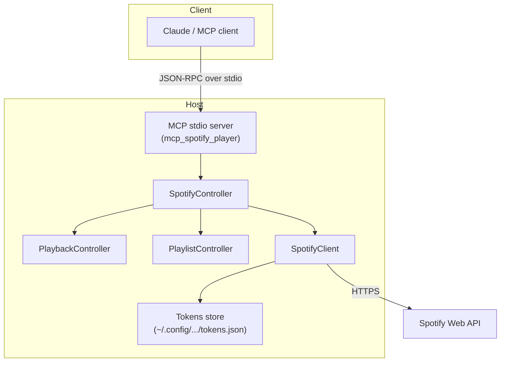
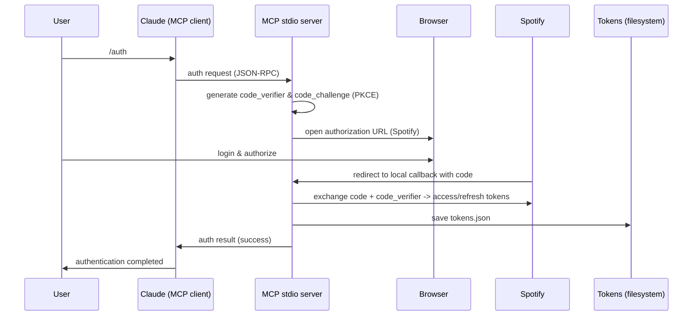
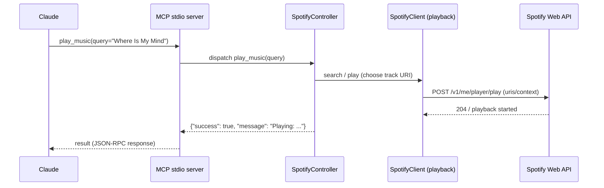

<a id="mcp-spotify-player"></a>
# 🎵 MCP Spotify Player

<div align="center">

[](https://github.com/victor-saez-gonzalez/mcp-spotify-player/stargazers)
[](https://github.com/victor-saez-gonzalez/mcp-spotify-player/blob/main/LICENSE)
[](https://github.com/victor-saez-gonzalez/mcp-spotify-player/issues)
[](https://github.com/victor-saez-gonzalez/mcp-spotify-player/pulls)

**Control Spotify directly from your AI assistant using the Model Context Protocol**

[Installation](#installation) • [Features](#key-features) • [API Reference (Python)](#api-reference-python) • [Contribute](#contribute) • [License](#license)

</div>

---

<p align="center">
  
</p>
<p align="center"><em>Control Spotify from your assistant (Claude/Cursor/Void/IntelliJ).</em></p>

## 📖 Table of Contents

- [Overview](#overview)
- [Key Features](#key-features)
- [Prerequisites](#prerequisites)
- [Installation](#installation)
- [Configuration](#configuration)
  - [Spotify Configuration](#spotify-configuration)
  - [MCP Configuration with Claude Desktop](#mcp-configuration-with-claude-desktop)
- [Usage](#usage)
- [API Reference (Python)](#api-reference-python)
- [Architecture](#architecture)
- [Troubleshooting](#troubleshooting)
- [Contribute](#contribute)
- [License](#license)

<a id="overview"></a>
## 🎯 Overview

**MCP Spotify Player** is an innovative tool that integrates Spotify control with AI assistants via the Model Context Protocol (MCP). It enables users to control their music using natural language commands processed by an AI assistant, delivering a seamless music interaction experience.

### Why MCP Spotify Player?

- **AI Integration**: Full Spotify control via natural language
- **Automatic Authentication**: Secure and simplified OAuth flow
- **High Performance**: Fast responses to commands
- **Extensible**: Modular architecture for adding features
- **Open Source**: Active community and transparent development

<a id="key-features"></a>
## ✨ Key Features

### 🎵 Playback Control
- ▶️ Play / Pause music
- ⏭️ Skip tracks
- 🔄 Queue management
- 🔊 Volume control
- 🔁 Repeat modes

### 🔍 Search & Discovery
- Search tracks, artists and albums
- Browse playlists
- Personalized recommendations
- Playback history

### 📱 Device Management
- Switch between available devices
- Multi-device synchronization
- Remote playback control

### 🎨 Playlist Management
- Create and edit playlists
- Add / remove tracks
- Automatic organization
- Share playlists

<a id="prerequisites"></a>
## 📋 Prerequisites

Before you begin, make sure you have installed:

- **Python 3.10+** 
- **Spotify premium account** - [Premium recommended](https://www.spotify.com/premium/)
- **Spotify App** - [Create an app](https://developer.spotify.com/dashboard)

<a id="installation"></a>
## 🔧 Installation

1. **Clone the repository**:

```bash
   git clone <your-repository>
   cd mcp-spotify-player
```

2. **Install**:

```bash
  pip install .
```

For development:

```bash
  pip install -e .
```

3. **Set up environment variables**:

```bash
cp env.example .env
```

Edit the `.env` file with your Spotify credentials:

```env
   SPOTIFY_CLIENT_ID=your_client_id_here
   SPOTIFY_CLIENT_SECRET=your_client_secret_here
   SPOTIFY_REDIRECT_URI=http://127.0.0.1:8000/auth/callback
   # Optional: custom path to store OAuth tokens
   # Defaults to ~/.config/mcp_spotify_player/tokens.json
   MCP_SPOTIFY_TOKENS_PATH=/path/to/tokens.json
```

Note: dependencies are managed with `pyproject.toml`.

If `MCP_SPOTIFY_TOKENS_PATH` is not set, tokens will be stored in
   `~/.config/mcp_spotify_player/tokens.json` by default.

<a id="configuration"></a>
## ⚙️ Configuration

### Spotify Configuration

**Create an application on the Spotify Developer Dashboard**
1. Go to [Spotify Developer Dashboard](https://developer.spotify.com/dashboard)
2. Create a new application
3. Get your `CLIENT_ID` and `CLIENT_SECRET`
4. In the app settings, add `http://127.0.0.1:8000/auth/callback` as a redirect URI

**Configure credentials**
   
   Create a `.env` file at the project root:
   ```env
   SPOTIFY_CLIENT_ID=your_client_id_here
   SPOTIFY_CLIENT_SECRET=your_client_secret_here
   SPOTIFY_REDIRECT_URI=http://localhost:3000/callback
   MCP_SERVER_PORT=3000
   ```

### Token file format

When tokens are stored on disk they use a simple JSON structure. Example:

```json
{
  "access_token": "ACCESS",
  "refresh_token": "REFRESH",
  "expires_at": 1700000000,
  "scopes": [
    "user-read-playback-state",
    "user-modify-playback-state",
    "user-read-currently-playing",
    "user-read-recently-played",
    "user-read-playback-position",
    "user-top-read",
    "playlist-read-private",
    "playlist-read-collaborative",
    "playlist-modify-private",
    "user-library-read",
    "user-library-modify"
  ]
}
```

By default tokens are saved to `~/.config/mcp_spotify_player/tokens.json` unless `MCP_SPOTIFY_TOKENS_PATH` is configured.

### MCP Configuration with Claude Desktop

Add the server to your Claude Desktop configuration or other MCP client:

**Windows** (`%APPDATA%\Claude\claude_desktop_config.json`):
```json
{
  "mcpServers": {
    "spotify-player": {
      "command": "C:/path/to/python/distribution/python.exe",
      "args": [
        "-m",
        "mcp_spotify_player"
      ],
      "cwd": "C:/path/to/cloned/repo/mcp-spotify-player",
      "env": {
        "SPOTIFY_CLIENT_ID": "your_client_id",
        "SPOTIFY_CLIENT_SECRET": "your_client_secret",
        "SPOTIFY_REDIRECT_URI": "http://127.0.0.1:8000/auth/callback"
      }
    }
  }
}
```

**macOS/Linux** (`~/.config/claude/claude_desktop_config.json`):
```json
{
  "mcpServers": {
    "spotify-player": {
      "command": "/path/to/python/distribution/python.exe",
      "args": [
        "-m",
        "mcp_spotify_player"
      ],
      "cwd": "/path/to/cloned/repo/mcp-spotify-player",
      "env": {
        "SPOTIFY_CLIENT_ID": "your_client_id",
        "SPOTIFY_CLIENT_SECRET": "your_client_secret",
        "SPOTIFY_REDIRECT_URI": "http://127.0.0.1:8000/auth/callback"
      }
    }
  }
}
```

### Configuring MCP Server in PyCharm / IntelliJ

JetBrains IDEs (PyCharm, IntelliJ, etc.) with GitHub Copilot have native support for MCP servers.

1. Go to **File → Settings → GitHub Copilot → Model Context Protocol (MCP)**.
2. On the right side, click **Configure** to edit the `mcp.json` file.
3. Add the following snippet, replacing the paths and dummy credentials as needed:

```json
{
  "servers": {
    "spotify-player": {
      "command": "C:/Users/YourUser/AppData/Local/Programs/Python/Python311/python.exe",
      "args": ["-m", "mcp_spotify_player"],
      "cwd": "/path/to/cloned/repo/mcp-spotify-player",
      "env": {
        "SPOTIFY_CLIENT_ID": "your-client-id",
        "SPOTIFY_CLIENT_SECRET": "your-client-secret",
        "SPOTIFY_REDIRECT_URI": "http://127.0.0.1:8000/auth/callback"
      }
    }
  }
}
```

Replace `your-client-id` and `your-client-secret` with the credentials from your Spotify Developer Dashboard. **Do not commit your real credentials into version control.**

Once configured, the server will appear in the Copilot Agent inside PyCharm/IntelliJ, and tools like `/auth`, `/play_music`, and `/pause_music` can be invoked directly.


### Other MCP clients

Use `mcp-spotify-player.yaml` as a template (same fields: command, args, cwd, env).

<a id="usage"></a>
## 🎮 Usage

### Available Commands

| Command | Description | Example |
|---------|-------------|---------|
| `play_music` | Play music | `play_music — Play Where Is My Mind by The Pixies` |
| `pause_music` | Pause playback | `pause_music — Pause the music` |
| `skip_next` | Next track | `skip_next — Next song` |
| `skip_previous` | Previous track | `skip_previous — Previous song` |
| `set_volume` | Set playback volume (0-100) | `set_volume — Set volume to 50%` |
| `set_repeat` | Set repeat mode (`off`, `track`, `context`) | `set_repeat — Set repeat mode to off, track, or context (e.g., "Repeat current track")` |
| `get_current_playing` | Get the currently playing track | `get_current_playing — What's playing?` |
| `get_playback_state` | Get full playback state | `get_playback_state — What's the playback state?` |
| `get_devices` | List available playback devices | `get_devices — List my available devices` |
| `search_music` | Search for tracks/artists/albums | `search_music — Search for songs by Queen` |
| `search_collections` | Search for playlists or albums | `search_collections — Search for playlists or albums` |
| `get_playlists` | List user playlists | `get_playlists — List my playlists` |
| `get_playlist_tracks` | Get tracks in a playlist | `get_playlist_tracks — Show tracks in playlist 'Road Trip'` |
| `get_artist` | Get artist information by ID | `get_artist — Show info about artist with a given ID` |
| `get_artist_albums` | Get albums for an artist by ID | `get_artist_albums — Show albums of an artist by ID` |
| `get_artist_top_tracks` | Get top tracks for an artist by ID | `get_artist_top_tracks — Show top tracks of an artist by ID` |
| `get_album` | Get album information by ID | `get_album — Show info about album 'The Dark Side of the Moon'` |
| `get_albums` | Get multiple albums information | `get_albums — Show info about multiple albums` |
| `get_album_tracks` | Get tracks in an album | `get_album_tracks — Show tracks in album 'The Dark Side of the Moon'` |
| `get_saved_albums` | List saved albums in library | `get_saved_albums — List my saved albums` |
| `check_saved_albums` | Check if albums are saved | `check_saved_albums — Check if these albums are saved` |
| `save_albums` | Save albums to library | `save_albums — Save these albums to my library` |
| `delete_saved_albums` | Remove albums from library | `delete_saved_albums — Remove these albums from my library` |
| `create_playlist` | Create a new playlist | `create_playlist — Create playlist 'Road Trip' with these songs...'` |
| `rename_playlist` | Rename an existing playlist | `rename_playlist — Rename playlist 'Road Trip' to 'Vacation'` |
| `clear_playlist` | Remove all tracks from a playlist | `clear_playlist — Remove all songs from playlist 'Road Trip'` |
| `add_tracks_to_playlist` | Add tracks to a playlist | `add_tracks_to_playlist — Add these songs to playlist 'Road Trip'` |
| `queue_add` | Add a track to the queue | `queue_add — Add this track to the queue` |
| `queue_list` | Show upcoming queue | `queue_list — Show the upcoming queue` |
| `diagnose` | Display diagnostic information | `diagnose — Display diagnostic information` |

### Usage Examples

#### With Claude or your AI assistant:

```text
User: "Play relaxing music for work"
Claude: [Performs search and plays a relaxing playlist]

User: "Raise the volume to 80%"
Claude: [Sets volume to 80%]

User: "Create a playlist with the best 80s songs"
Claude: [Creates playlist and adds popular 80s tracks]
```

#### Programmatic usage (Python)

```python
from pathlib import Path
from mcp_spotify_player.spotify_controller import SpotifyController
from mcp_spotify_player.client_auth import load_tokens

# Load tokens from the default path (adjust if you store them elsewhere)
tokens_path = Path.home() / '.config' / 'mcp_spotify_player' / 'tokens.json'
# load_tokens returns a Tokens object or raises if missing
tokens = load_tokens(tokens_path)

# SpotifyController expects a zero-arg callable that returns tokens
controller = SpotifyController(lambda: tokens)

if not controller.is_authenticated():
    raise SystemExit("Run the auth tool first (use the auth command in your MCP client)")

# Play a song by query (search + play)
controller.play_music(query="Bohemian Rhapsody")

# Get currently playing track
current = controller.get_current_playing()
if current and current.get("item"):
    name = current["item"]["name"]
    artist = current["item"]["artists"][0]["name"]
    print(f"Now playing: {name} — {artist}")

# Create a playlist and add tracks (example)
playlist_resp = controller.create_playlist(playlist_name="Road Trip 2024", description="Road trip mix")
# create_playlist returns {"success": True, "playlist": {...}}
playlist_id = None
if isinstance(playlist_resp, dict) and playlist_resp.get("success") and playlist_resp.get("playlist"):
    playlist_id = playlist_resp["playlist"].get("id")

if playlist_id:
    controller.add_tracks_to_playlist(playlist_id=playlist_id, track_uris=["spotify:track:TRACK_URI_1", "spotify:track:TRACK_URI_2"])
else:
    print("Could not create playlist or retrieve playlist id")
```

<a id="api-reference-python"></a>
## 📚 API Reference (Python)

This project exposes a Python-first API via the SpotifyController facade. The controller delegates functionality to PlaybackController, PlaylistController, Albums and Artists controllers. Signatures and return values below reflect the current implementation.

### SpotifyController

A facade that aggregates playback, playlist, album and artist operations.

Constructor

```text
SpotifyController(tokens_provider: Callable[[], Optional[Tokens]])
```
- tokens_provider: zero-argument callable that returns a Tokens object or None.

Methods (delegated to underlying controllers)

- is_authenticated() -> bool
  - Returns True if tokens are present and not expired.

Playback-related (via PlaybackController)

- play_music(query: Optional[str] = None, playlist_name: Optional[str] = None, track_uri: Optional[str] = None, artist_uri: Optional[str] = None) -> Dict[str, Any]
  - Play a track by search query, specific track URI, playlist name or artist URI. Returns a dict with success/message and optional details.

- pause_music() -> Dict[str, Any]
  - Pause playback.

- skip_next() -> Dict[str, Any]
  - Skip to next track.

- skip_previous() -> Dict[str, Any]
  - Skip to previous track.

- set_volume(volume_percent: int) -> Dict[str, Any]
  - Set device volume (0-100).

- set_repeat(state: str) -> Dict[str, Any]
  - Set repeat mode. state is one of 'off', 'track', 'context'.

- get_current_playing() -> Dict[str, Any]
  - Returns a dict with success and track info (name, artist, album, uri, duration_ms, external_url), is_playing and progress_ms.

- get_playback_state() -> Dict[str, Any]
  - Returns full playback state including is_playing, current_track (TrackInfo dict) volume_percent, device_name, shuffle_state and repeat_state.

- get_devices() -> Dict[str, Any]
  - Returns a list of available playback devices.

- search_music(query: str, search_type: str = "track", limit: int = 10) -> Dict[str, Any]
  - Search for tracks or artists. For track searches returns a list of TrackInfo dicts.

- search_collections(q: str, type: str, limit: int = 20, offset: int = 0, market: Optional[str] = None) -> Dict[str, Any]
  - Search for playlists or albums. Returns container info and items.

- queue_add(uri: str, device_id: Optional[str] = None) -> Dict[str, Any]
  - Add a track/episode URI to the active device queue.

- queue_list(limit: Optional[int] = None) -> Dict[str, Any]
  - Get the upcoming queue (delegates to the client).


### PlaylistController

- get_playlists() -> Dict[str, Any]
  - Returns user's playlists as a list of PlaylistInfo dicts.

- create_playlist(playlist_name: str, description: str = "") -> Dict[str, Any]
  - Create a new playlist (private by default). Returns the created playlist info.

- get_playlist_tracks(playlist_id: str, limit: int = 20) -> Dict[str, Any]
  - Return tracks in a playlist as TrackInfo dicts.

- rename_playlist(playlist_id: str, playlist_name: str) -> Dict[str, Any]
  - Rename a playlist.

- clear_playlist(playlist_id: str) -> Dict[str, Any]
  - Remove all tracks from a playlist.

- add_tracks_to_playlist(playlist_id: str, track_uris: List[str]) -> Dict[str, Any]
  - Add valid Spotify track URIs (spotify:track:...) to a playlist.


### Data models returned (summary)

- TrackInfo: dict with keys: name, artist, album, uri, duration_ms, external_url
- PlaylistInfo: dict with playlist metadata (id, name, description, owner, track_count, uri)


### Example (Python)

```python
from pathlib import Path
from mcp_spotify_player.client_auth import load_tokens
from mcp_spotify_player.spotify_controller import SpotifyController

tokens = load_tokens(Path.home() / '.config' / 'mcp_spotify_player' / 'tokens.json')
controller = SpotifyController(lambda: tokens)

if controller.is_authenticated():
    controller.play_music(query='Where Is My Mind by The Pixies')
    state = controller.get_playback_state()
    print(state)
```

[See implementation in src/mcp_spotify_player/* controllers]

<a id="architecture"></a>
## 🏗️ Architecture

Below are three conceptual views to help understand the system: a components diagram, the OAuth (PKCE) authorization flow, and a sequence diagram for a typical MCP command (e.g., play_music).

### 1) Components (logical)

This diagram shows the main modules and how an MCP client (Claude) connects to the MCP stdio server, which delegates to the SpotifyController and underlying clients. Tokens are persisted on disk.



### 2) OAuth (PKCE) flow

PKCE flow used by the server when running the interactive `/auth` command. Important note: when the server runs as an MCP stdio process inside a client (e.g., Claude Desktop), the browser callback must be reachable from the same host.



### 3) Command sequence (play_music)

Sequence of a typical user command from Claude to Spotify and back.



> Note: when using Claude (or any MCP client running the server as stdio), ensure the MCP server process and the browser used for PKCE callback run on the same host or that the redirect URI is reachable from that host.

### Project structure

```
mcp-spotify-player/
├── src/
│   ├── mcp_logging/
│   │   └── __init__.py
│   ├── mcp_spotify/
│   │   ├── __init__.py
│   │   └── errors.py
│   └── mcp_spotify_player/
│       ├── __init__.py
│       ├── __main__.py
│       ├── album_controller.py
│       ├── cli.py
│       ├── client_albums.py
│       ├── client_auth.py
│       ├── client_playback.py
│       ├── client_playlists.py
│       ├── client_artists.py
│       ├── config.py
│       ├── mcp_manifest.py
│       ├── mcp_models.py
│       ├── mcp_stdio_server.py
│       ├── playback_controller.py
│       ├── playlist_controller.py
│       ├── artists_controller.py
│       ├── spotify_client.py
│       └── spotify_controller.py
├── pyproject.toml
└── requirements.txt
```

### MCP stdio server

- This project exposes an MCP stdio server for integration with MCP clients (Claude and other MCP-compatible tools).
- Communication protocol: JSON-RPC over stdio.
- Recommended server command for integration and development:

```bash
python -m mcp_spotify_player
```

### Run in development mode

```bash
mcp-spotify-player
# or
python -m mcp_spotify_player
```

<a id="troubleshooting"></a>
## 🔧 Troubleshooting

If you encounter issues when using the MCP server or commands, check these common cases below.

### Authentication error

Issue: "Invalid client credentials" or other errors when exchanging the OAuth code

Fix:
1. Verify SPOTIFY_CLIENT_ID and SPOTIFY_CLIENT_SECRET are correct in your `.env` or MCP server configuration. Ensure those environment variables are available to the process that runs the server (your MCP client must pass env when launching the server).
2. Make sure the Redirect URI registered in the Spotify Dashboard exactly matches (scheme, host and port) the `SPOTIFY_REDIRECT_URI` used by the server.
3. Check the system clock (a desynchronized clock can cause OAuth token exchange failures).
4. If problems persist, regenerate the credentials in the Dashboard and try again.
5. Inspect server logs for error details (see "Check logs" below).

### Cannot control playback

Issue: "No active device found" or API responds that playback/transfer is not possible

Fix:
1. Ensure Spotify is open and there is an active session on some device (desktop app, mobile app or Web Player). Often starting playback manually on the device is enough.
2. Verify the account is Premium — remote playback control via the Web API requires a Premium account.
3. Run the `get_devices` command (or the equivalent in your MCP client) and confirm which devices are available and which `device_id` is active.
4. Confirm the authorized scopes include `user-modify-playback-state` and `user-read-playback-state` — if not, re-authorize the app with the needed scopes.
5. If needed, start playback on the target device and use the API to transfer playback to it.

### Commands not recognized / not working in the MCP client

Issue: Commands sent from the client (e.g. Claude Desktop) have no effect or the client reports errors

Fix:
1. Verify your MCP server configuration in the client: `command`, `args`, `cwd`, and `env`. Ensure the path to Python and the module (`-m mcp_spotify_player`) are correct and that necessary environment variables (SPOTIFY_*) are present.
2. Ensure the server process is running. If the server is started as a stdio process, the client must have started it successfully.
3. Check the server output (stdout/stderr). By default logs are printed to the console; to write logs to a file set the `MCP_LOG_FILE` environment variable.
4. If using Claude Desktop, restart the app after changing the server configuration.
5. Verify tokens exist and are not expired (tokens file at `~/.config/mcp_spotify_player/tokens.json` by default) and that the server's token provider is returning valid tokens.

### Check logs

- By default logs are sent to standard error (stderr). To save logs to a file, export `MCP_LOG_FILE=/path/to/file.log` before starting the server.
- Adjust verbosity with `MCP_LOG_LEVEL` (`DEBUG`, `INFO`, `WARNING`, `ERROR`).
- When sharing logs for debugging, include only relevant fragments and redact credentials or tokens.

<a id="contribute"></a>
## Contribute

Contributions are welcome! Please read our [CONTRIBUTING.md](CONTRIBUTING.md) before opening a PR.

### How to contribute

1. **Fork** the repository
2. **Create** a branch for your feature (`git checkout -b feature/AmazingFeature`)
3. **Commit** your changes (`git commit -m 'Add some AmazingFeature'`)
4. **Push** to your branch (`git push origin feature/AmazingFeature`)
5. **Open** a Pull Request

### Local development

```bash
# Install package in editable mode and project dependencies
python -m pip install -e .

# (Optional) install test/dev dependencies listed in requirements.txt
python -m pip install -r requirements.txt

# Run tests
python -m pytest

# Run linter/formatters if configured (example using ruff)
# python -m pip install ruff
# ruff check .
```

<a id="license"></a>
## 📄 License

This project is licensed under the MIT License - see the [LICENSE](LICENSE) file for details.

```
MIT License

Copyright (c) 2025 Víctor Sáez

Permission is hereby granted, free of charge, to any person obtaining a copy
of this software and associated documentation files (the "Software"), to deal
in the Software without restriction...
```

## 🙏 Acknowledgements

- [Spotify Web API](https://developer.spotify.com/documentation/web-api/) for providing the API
- [Anthropic](https://www.anthropic.com/) for the Model Context Protocol
- The community of contributors and users

<a id="contact-support"></a>
## 📞 Contact & Support

- **Author**: Víctor Sáez
- **Email**: [victor.saez.dev@gmail.com](mailto:victor.saez.dev@gmail.com)
- **Issues**: [GitHub Issues](https://github.com/victor-saez-gonzalez/mcp-spotify-player/issues)

---

<div align="center">

**Do you like this project? Give it a ⭐ on GitHub!**

[⬆ Back to top](#-mcp-spotify-player)

